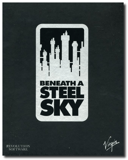
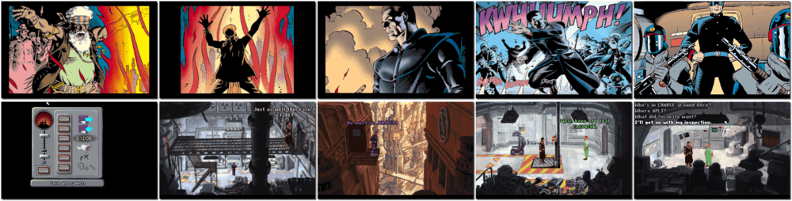

# Beneath a Steel Sky

「**Beyond The Abyss**」

> ❝ Robert Foster is an innocent outsider stranded in a vast city where oppressed civilians live and work in soaring tower blocks. All while the corrupt, covetous and wealthy lie underground, shielded from all pollution. Alone with a robot circuit board, Foster must fight for survival and discover the sinister truth behind this abduction. ❞
>
> ❝ The game was made available as freeware – and with the source code released – for PC platforms in 2003. ❞ — *Wikipedia*
>

📌 ┃ **Year** ‣ 1994 ┃ **Genre** ‣ Adventure ┃ **Platform** ‣ DOS ┃ **License** ‣ Freeware ┃ **Media** ‣ CD-ROM 

📦 ┃ **[DOSBox](https://www.dosbox.com/) 🟩** ┃ **[DOSBox Staging](https://dosbox-staging.github.io/) 🟩** ┃ **[DOSBox-X](https://dosbox-x.com/) 🟩** 

📎 ┃ **[Wikipedia](https://en.wikipedia.org/wiki/Beneath_a_Steel_Sky)** ┃ **[MobyGames](https://www.mobygames.com/game/386/beneath-a-steel-sky/)** ┃ **[MyAbandonware](https://www.myabandonware.com/game/beneath-a-steel-sky-21i)** ┃ **[GOG 🆓](https://www.gamesdatabase.org/game/microsoft-dos/beneath-a-steel-sky)** 

## Installation Notes
- Use the default **drive** and **directory** for the installation location.
- Setup Menu:
  - Sound Card: **Sound Blaster / Ad lib**.
  - Port Addresses: All **Auto-Detect**.

---

