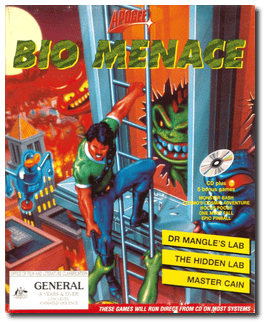

# Bio Menace

「**Bio Hazard**」

> ❝ You are Snake Logan, a top CIA operative who likes to do things his way. Metro City has fallen under the attack of hideous mutants. Your mission is to fly recon over the city and report back. While circling over the city, you're shot down by hostile forces and forced to crash land on the streets of Metro. Grabbing any supplies you can find, you are out to discover the source of these mutants and especially the guy who shot you down! ❞
>
> ❝ Apogee released the game as freeware on December 23, 2005 as a 'Christmas present', and the full game can be downloaded from the Apogee website. ❞ — *Wikipedia*
>

📌 ┃ **Year** ‣ 1993 ┃ **Genre** ‣ Action ┃ **Platform** ‣ DOS ┃ **License** ‣ Freeware ┃ **Category** ‣ Side view • Platform ┃ **Media** ‣ Compressed Package 

📦 ┃ **[DOSBox](https://www.dosbox.com/) 🟩** ┃ **[DOSBox Staging](https://dosbox-staging.github.io/) 🟩** ┃ **[DOSBox-X](https://dosbox-x.com/) 🟩** 

📎 ┃ **[Wikipedia](https://en.wikipedia.org/wiki/Bio_Menace)** ┃ **[MobyGames](https://www.mobygames.com/game/236/bio-menace/)** ┃ **AbandonwareDOS** ‣ [Bio Menace Episode 1: Dr. Mangle's Lab](https://www.abandonwaredos.com/abandonware-game.php?abandonware=Bio+Menace+Episode+1%3A+Dr.+Mangle%27s+Lab&gid=1345) • [Bio Menace Episode 2: The Hidden Lab](https://www.abandonwaredos.com/abandonware-game.php?abandonware=Bio+Menace+Episode+2%3A+The+Hidden+Lab&gid=2964) • [Bio Menace Episode 3: Master Cain](https://www.abandonwaredos.com/abandonware-game.php?abandonware=Bio+Menace+Episode+3%3A+Master+Cain&gid=2965) ┃ **[MyAbandonware](https://www.myabandonware.com/game/bio-menace-22a)** ┃ **[GOG 🆓](https://www.gog.com/en/game/bio_menace)** ┃ **[3DRealms 🆓](https://3drealms.com/catalog/bio-menace_42/)** 

