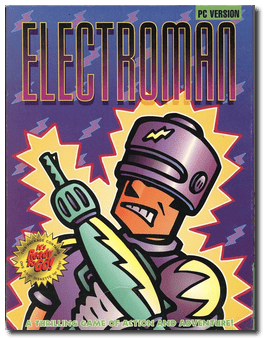
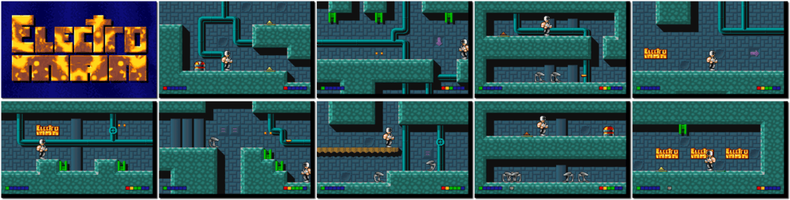

# Electroman

「**Electro Man**」「**Electro Body**」

> ❝ After drifting off to sleep late one night at the planetary base, Jacek woke to discover that his unit had lost all its power. Climbing the darkened stairway, he found that alien beings had invaded the HQ and killed all humans - including his wife and children! Only his friend Placek remained, and together they escaped to another planet. Now it is time for revenge. Spending all his insurance money, Jacek underwent many costly operations giving him superhuman strength and senses. He armed himself with weapons and set out for the conquered station. Jacek is unaware that the aliens have rebuilt the station with numerous security systems built to keep him out. Can you help our hero? ❞
>
> ❝ Though initially offered under a shareware license, the game was released as freeware by the developer on June 25, 2006, under the Creative Commons Attribution-ShareAlike 2.5 license. ❞ — *Wikipedia*
>

📌 ┃ Year: **1992** ┃ Genre: **Action** ┃ Platform: **DOS** ┃ License: **Freeware** ┃ Category: **Side view • Platform • Shooter • Sci-fi** ┃ Media: **Compressed Package** 

📦 ┃ **[DOSBox](https://www.dosbox.com/) 🟩** ┃ **[DOSBox Staging](https://dosbox-staging.github.io/) 🟩** ┃ **[DOSBox-X](https://dosbox-x.com/) 🟩** 

📎 ┃ **[Wikipedia](https://en.wikipedia.org/wiki/Electro_Man)** ┃ **[MobyGames](https://www.mobygames.com/game/752/electroman/)** ┃ **[AbandonwareDOS](https://www.abandonwaredos.com/abandonware-game.php?abandonware=Electroman&gid=3021)** ┃ **[MyAbandonware](https://www.myabandonware.com/game/electroman-1ux)** 

