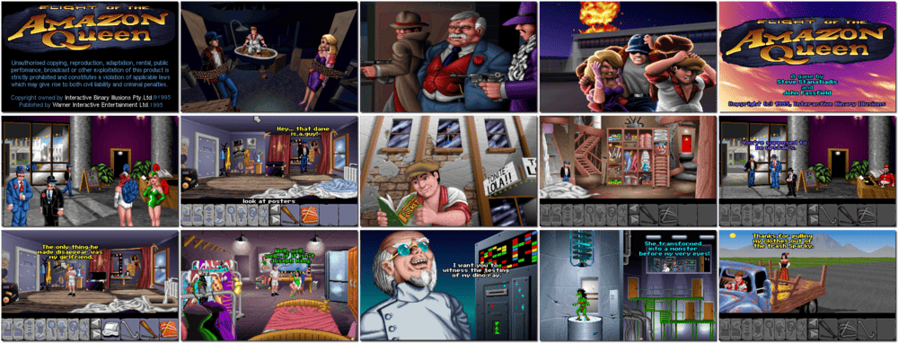

# Flight of the Amazon Queen

> ❝ Joe King, a pilot for hire and owner of the Amazon Queen aeroplane, arrives at a hotel in Rio de Janeiro to transport his next customer, famous film actress Faye Russel only to be ambushed by his Dutch rival Anderson. When Joe pilots the Amazon Queen towards the location of Faye's shoot, a storm causes him to crashland in the Amazon jungle. Joe begins searching the jungle, encountering an entire tribe of Amazon women who capture him and take in Faye. ❞
>
> ❝ In March 2004, the game was released as freeware, and support for it was added to ScummVM, allowing it to be played on Linux, Mac OS X, Windows, and many other operating systems and consoles. ❞ — *Wikipedia*
>

📌 ┃ Year: **1995** ┃ Genre: **Adventure** ┃ Platform: **DOS** ┃ License: **Freeware** ┃ Category: **3rd-person • Graphic adventure • Puzzle elements** ┃ Media: **CD-ROM** 

📦 ┃ **[DOSBox](https://www.dosbox.com/) 🟩** ┃ **[DOSBox Staging](https://dosbox-staging.github.io/) 🟩** ┃ **[DOSBox-X](https://dosbox-x.com/) 🟩** 

📎 ┃ **[Wikipedia](https://en.wikipedia.org/wiki/Flight_of_the_Amazon_Queen)** ┃ **[MobyGames](https://www.mobygames.com/game/352/flight-of-the-amazon-queen/)** ┃ **[AbandonwareDOS](https://www.abandonwaredos.com/abandonware-game.php?abandonware=Flight+of+the+Amazon+Queen&gid=1780)** ┃ **[MyAbandonware](https://www.myabandonware.com/game/flight-of-the-amazon-queen-2rn)** ┃ **[GOG 🆓](https://www.gog.com/en/game/flight_of_the_amazon_queen)** 

## Installation Notes
- Music: **Sound Blaster**
- Sound Effects: **Sound Blaster**
- Press `ENTER` when done.

