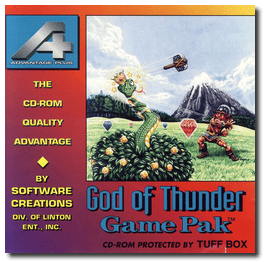
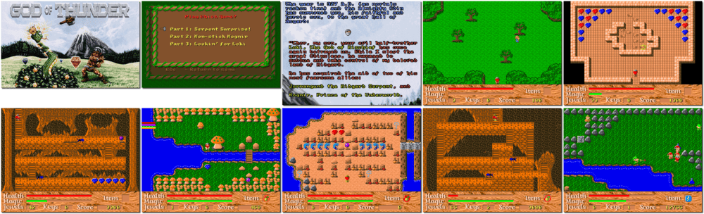

# God of Thunder

> ❝ You are Thor, The God of Thunder! Your father is Odin, the mightiest Norse God and the ruler of Asgard. Odin must fall into a deep sleep (known as the Odinsleep) every few hundred centuries to rejuvenate his power. Your half-brother is Loki, The God of Mischief. Loki has seized the opportunity of this most recent Odinsleep and obtained the help of his most powerful allies to take control of Midgard (Earth). ❞
>
> ❝ On March 27, 2020, Ron Davis released the source code, music and sound effects as public-domain software on SourceForge. ❞ — *Wikipedia*
>

📌 ┃ **Year** ‣ 1993 ┃ **Genre** ‣ Action ┃ **Platform** ‣ DOS ┃ **License** ‣ Freeware ┃ **Category** ‣ Top-down • Puzzle elements • Fantasy ┃ **Media** ‣ Compressed Package 

📦 ┃ **[DOSBox](https://www.dosbox.com/) 🟩** ┃ **[DOSBox Staging](https://dosbox-staging.github.io/) 🟩** ┃ **[DOSBox-X](https://dosbox-x.com/) 🟩** 

📎 ┃ **[Wikipedia](https://en.wikipedia.org/wiki/God_of_Thunder_(video_game))** ┃ **[MobyGames](https://www.mobygames.com/game/1019/god-of-thunder/)** ┃ **[AbandonwareDOS](https://www.abandonwaredos.com/abandonware-game.php?abandonware=God+of+Thunder&gid=1277)** ┃ **[MyAbandonware](https://www.myabandonware.com/game/god-of-thunder-1um)** ┃ **[Adept Software](https://www.adeptsoftware.com/got/)** 

