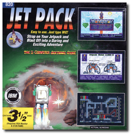

# Jetpack

> ❝ Use your Jetpack model L1069-E to explore 100 hazardous levels of dungeons! Equipped with Jet Turbines and armed with a powerful Phase Shifter, you quest for precious gems through dungeons full of treasures and peril. ❞
>
> ❝ Jetpack is a platform game available as freeware, developed by American studio Adept Software and originally published as shareware by Software Creations in 1993. ❞ — *Wikipedia*
>

📌 ┃ **Year** ‣ 1993 ┃ **Genre** ‣ Action ┃ **Platform** ‣ DOS ┃ **License** ‣ Freeware ┃ **Category** ‣ Side view • Arcade • Platform • Puzzle elements • Shooter ┃ **Media** ‣ Compressed Package 

📦 ┃ **[DOSBox](https://www.dosbox.com/) 🟩** ┃ **[DOSBox Staging](https://dosbox-staging.github.io/) 🟩** ┃ **[DOSBox-X](https://dosbox-x.com/) 🟩** 

📎 ┃ **[Wikipedia](https://en.wikipedia.org/wiki/Jetpack_(video_game))** ┃ **[MobyGames](https://www.mobygames.com/game/10449/jetpack/)** ┃ **[AbandonwareDOS](https://www.abandonwaredos.com/abandonware-game.php?abandonware=Jetpack&gid=1263)** ┃ **[MyAbandonware](https://www.myabandonware.com/game/jetpack-1pg)** ┃ **[Adept Software](https://www.adeptsoftware.com/jetpack/)** 

