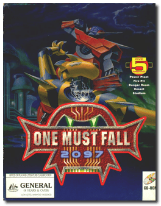
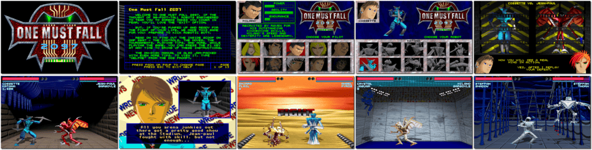

# One Must Fall: 2097

「**OMF:2097**」

> ❝ Governments are puppets to big corporations and the largest corporation being “World Aeronautics and Robotics” (WAR). If you want to get ahead in the competitive corporate corridors of WAR, you need to master the use of human-assisted robots (HARs). These gigantic robots’ purposes include defence and controlling far-flung planetary outposts. The next outpost up for colonization is Jupiter’s moon Ganymede. The highly-paid job as pilot of the WAR representative will compete fiercely, and you must qualify for the position by proving your worth in the arena. It will be the grandest one-on-one combat since the Roman Era. ❞
>
> ❝ In February 1999, the game was declared freeware by the developers. ❞ — *Wikipedia*
>

📌 ┃ **Year** ‣ 1994 ┃ **Genre** ‣ Action ┃ **Platform** ‣ DOS ┃ **License** ‣ Freeware ┃ **Category** ‣ Side view • Arcade • Fighting • Mecha • Sci-fi ┃ **Media** ‣ CD-ROM 

📦 ┃ **[DOSBox](https://www.dosbox.com/) 🟩** ┃ **[DOSBox Staging](https://dosbox-staging.github.io/) 🟩** ┃ **[DOSBox-X](https://dosbox-x.com/) 🟩** 

📎 ┃ **[Wikipedia](https://en.wikipedia.org/wiki/One_Must_Fall:_2097)** ┃ **[MobyGames](https://www.mobygames.com/game/234/one-must-fall-2097/)** ┃ **[AbandonwareDOS](https://www.abandonwaredos.com/abandonware-game.php?abandonware=One+Must+Fall+2097&gid=1843)** ┃ **[MyAbandonware](https://www.myabandonware.com/game/one-must-fall-2097-2a7)** 

## Installation Notes
- Use the default **drive** and **directory** for the installation location.

## Additional Notes
- Select sound card: **Sound Blaster 16 (Stereo)** and **Ultra High Quality (Pentium)**.

