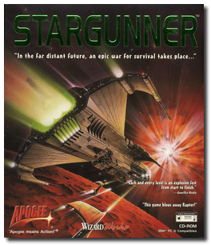
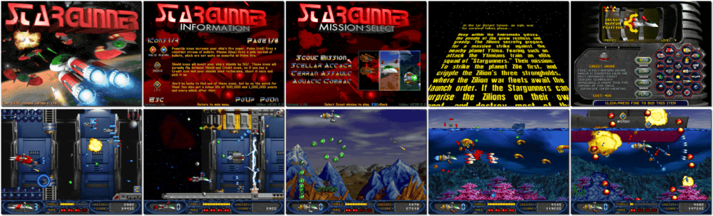

# Stargunner

> ❝ Deep within the Andromeda galaxy, the people of Zile grow restless and greedy. The Zilions secretly prepare for a massive strike against the nearby planet Ytima. Fearing such an attack, the Ytimians train an elite squad of "Stargunners." Their mission: To strike and wipe out the Zilions' three strongholds, where the Zilion war fleets await the launch order. Good will triumph if the Stargunners can surprise the Zilions and destroy most of their fleet. ❞
>
> ❝ On June 22, 2005, Stargunner was released as freeware. ❞ — *Wikipedia*
>

📌 ┃ **Year** ‣ 1996 ┃ **Genre** ‣ Action ┃ **Platform** ‣ DOS ┃ **License** ‣ Freeware ┃ **Category** ‣ Side view • Shooter • Sci-fi ┃ **Media** ‣ Compressed Package 

📦 ┃ **[DOSBox](https://www.dosbox.com/) 🟩** ┃ **[DOSBox Staging](https://dosbox-staging.github.io/) 🟩** ┃ **[DOSBox-X](https://dosbox-x.com/) 🟩** 

📎 ┃ **[Wikipedia](https://en.wikipedia.org/wiki/Stargunner)** ┃ **[MobyGames](https://www.mobygames.com/game/922/stargunner/)** ┃ **[AbandonwareDOS](https://www.abandonwaredos.com/abandonware-game.php?abandonware=Stargunner&gid=2492)** ┃ **[MyAbandonware](https://www.myabandonware.com/game/stargunner-c8g)** ┃ **[3DRealms 🆓](https://3drealms.com/catalog/stargunner_45/)** ┃ **[GOG 🆓](https://www.gog.com/en/game/stargunner)** ┃ **[Steam 🆓](https://store.steampowered.com/app/358390/Stargunner/)** 

