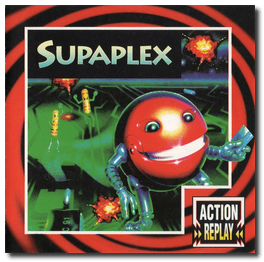
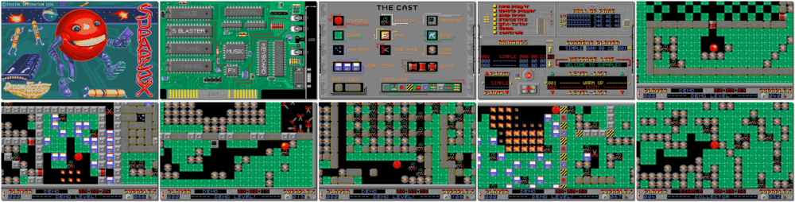

# Supaplex

「**Think!**」

> ❝ You are Murphy, a bug hunter extraordinaire, exploring deep inside a crazy computer. The only way out of each brain-teasing level is to collect the Infotrons. The fun begins! Avoid Snik Snaks at all costs; falling Zonks will trap the unwary, exploding discs, electrons, and ports. All add up to this awesome action game! ❞
>
> ❝ The developers of the game have declared the software to be freeware. ❞ — *Wikipedia*
>

📌 ┃ **Year** ‣ 1991 ┃ **Genre** ‣ Puzzle ┃ **Platform** ‣ DOS ┃ **License** ‣ Freeware ┃ **Category** ‣ Side view ┃ **Media** ‣ CD-ROM ┃ **Patched • Copy Protection** 

📦 ┃ **[DOSBox](https://www.dosbox.com/) 🟩** ┃ **[DOSBox Staging](https://dosbox-staging.github.io/) 🟩** ┃ **[DOSBox-X](https://dosbox-x.com/) 🟩** 

📎 ┃ **[Wikipedia](https://en.wikipedia.org/wiki/Supaplex)** ┃ **[MobyGames](https://www.mobygames.com/game/2106/supaplex/)** ┃ **[AbandonwareDOS](https://www.abandonwaredos.com/abandonware-game.php?abandonware=Supaplex&gid=1618)** ┃ **[MyAbandonware](https://www.myabandonware.com/game/supaplex-19v)** ┃ **[Artsoft - Rocks'n'Diamonds](https://www.artsoft.org/rocksndiamonds/)** ┃ **Game Patch** ‣ [Boulder Dash Fan Site 🔓](http://www.bd-fans.com/Supaplex.html) 

## Installation Notes
- Use the default **drive** and **directory** for the installation location.

## Additional Notes
- Consult `Assets/MANUAL.PDF` for the game copy protection.
- Click **controls** from the main menu to configure the sound. Select **S.BLASTER + MUSIC + FX**.

