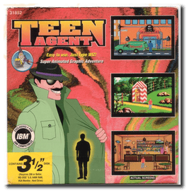
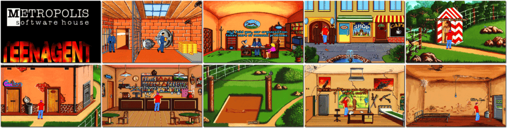

# Teen Agent

「**Teenagent** (Polish/Original)」

> ❝ One day, two men in dark glasses and long coats captured a teenager; this could be a start of a very long day! Get ready for a wonderfully humorous adventure. Teen Agent is a point-and-click animated graphic adventure that features dozens of detailed hand-painted backgrounds. ❞
>
> ❝ When the game was originally released, "The Three Tasks" was shareware, and the remaining two sections could be obtained by registering the game. However, the game was later released as freeware. ❞ — *Wikipedia*
>

📌 ┃ **Year** ‣ 1995 ┃ **Genre** ‣ Adventure ┃ **Platform** ‣ DOS ┃ **License** ‣ Freeware ┃ **Category** ‣ 3rd-person • Graphic adventure • Contemporary • Europe • Comedy • Detective • Spy ┃ **Media** ‣ Compressed Package ┃ **No Manual** 

📦 ┃ **[DOSBox](https://www.dosbox.com/) 🟩** ┃ **[DOSBox Staging](https://dosbox-staging.github.io/) 🟩** ┃ **[DOSBox-X](https://dosbox-x.com/) 🟩** 

📎 ┃ **[Wikipedia](https://en.wikipedia.org/wiki/Teenagent)** ┃ **[MobyGames](https://www.mobygames.com/game/6423/teen-agent/)** ┃ **[AbandonwareDOS](https://www.abandonwaredos.com/abandonware-game.php?abandonware=Teen+Agent&gid=2206)** ┃ **[MyAbandonware](https://www.myabandonware.com/game/teen-agent-23o)** ┃ **[GOG 🆓](https://www.gog.com/en/game/teenagent)** 

## Installation Notes
- Sound Source Setup: Select **SoundBlaster**, **Music and Sound**, **220h**, **IRQ 7**, and **DMA channel 1**. Save setup & exit.

