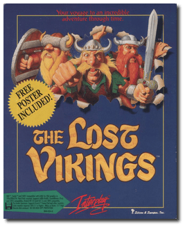
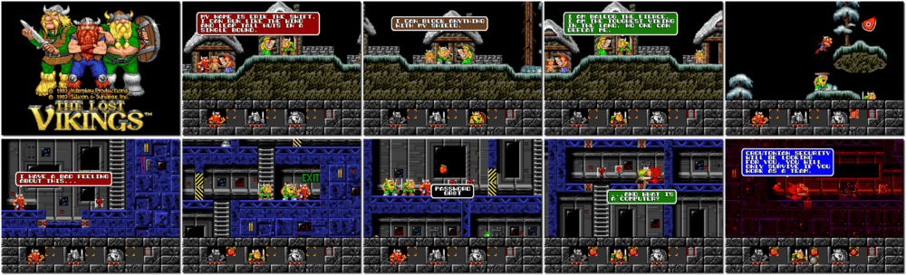

# The Lost Vikings

> ❝ Three hairy Norsemen set the stage for a decade of legendary adventure. Meet Erik the Swift, Baleog the Fierce, and Olaf the Stout - your typical, borderline-insane Vikings who happen to get abducted by aliens. Now it's up to you to slash, smash and solve their way home, an intense arcade action. Pillage and plunder your way through 35 levels of mind-bending arcade action. Combine the unique skills of three distinct Viking personalities to conquer dozens of marauding foes. ❞
>
> ❝ In 2014, the game was added to Battle.net as a free download emulated through DOSBox. ❞ — *Wikipedia*
>

📌 ┃ **Year** ‣ 1993 ┃ **Genre** ‣ Action • Puzzle ┃ **Platform** ‣ DOS ┃ **License** ‣ Freeware ┃ **Media** ‣ Floppy Disk ┃ **Copy Protection** 

📦 ┃ **[DOSBox](https://www.dosbox.com/) 🟩** ┃ **[DOSBox Staging](https://dosbox-staging.github.io/) 🟩** ┃ **[DOSBox-X](https://dosbox-x.com/) 🟩** 

📎 ┃ **[Wikipedia](https://en.wikipedia.org/wiki/The_Lost_Vikings)** ┃ **[MobyGames](https://www.mobygames.com/game/1547/the-lost-vikings/)** ┃ **[MyAbandonware](https://www.myabandonware.com/game/the-lost-vikings-1mi)** 

## Installation Notes
- Use the default **drive** and **directory** for the installation location.
- Select sound driver: **Sound Blaster**; sound card port address: **220 (default)**.
- Consult `Assets/MANUAL.PDF` for the game copy protection.

---

