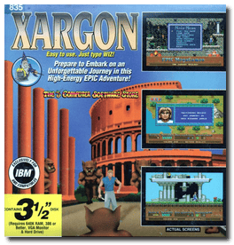
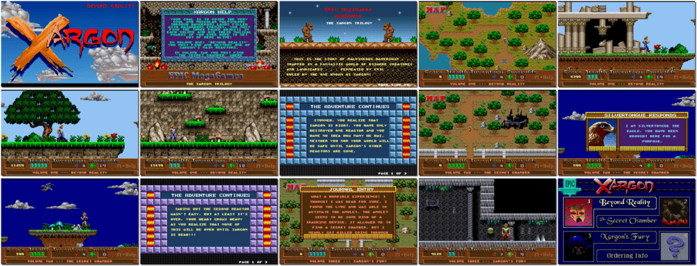

# Xargon

「**The Xargon Trilogy**」「**Xargon: The Mystery of the Blue Builders**」

> ❝ Trapped in a fantasy world of bizarre creatures and landscapes, guide archeologist Malvenious through dangerous lands and out of Xargon alive! Avoid spears, spikes & mechanical mashers as you fight lizards, trolls, enormous spiders and deadly purple hoppers through breathtaking 256-colour scenery & animation. Be prepared to lose touch with reality in this new magical adventure. ❞
>
> ❝ Allen Pilgrim declared the registered version freeware and released the source code on August 4, 2008. ❞ — *Wikipedia*
>

📌 ┃ Year: **1993** ┃ Genre: **Action** ┃ Platform: **DOS** ┃ License: **Freeware** ┃ Category: **Side view • Arcade • Platform • Fantasy** ┃ Media: **Compressed Package** 

📦 ┃ **[DOSBox](https://www.dosbox.com/) 🟩** ┃ **[DOSBox Staging](https://dosbox-staging.github.io/) 🟩** ┃ **[DOSBox-X](https://dosbox-x.com/) 🟩** 

📎 ┃ **[Wikipedia](https://en.wikipedia.org/wiki/Xargon)** ┃ **[MobyGames](https://www.mobygames.com/game/1057/xargon/)** ┃ **[AbandonwareDOS](https://www.abandonwaredos.com/abandonware-game.php?abandonware=Xargon&gid=2905)** ┃ **[MyAbandonware](https://www.myabandonware.com/game/xargon-21c)** 

